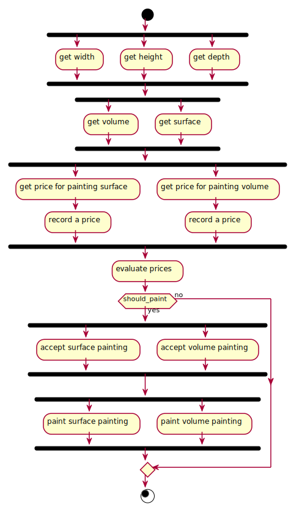

# Paint Example

This example is a simple demonstration on how to calculate some dimensions of an object to paint, check the prices for doing so, and deciding whether to paint or not based on the given price

The approach used for this example was a static immutable graph, meaning:
- We New the graph only once and it can be reused as many times as wanted
- The graph doesn't contain any state. The state is passed at execution time through the context

For demonstration purposes, the graph is built in a single method. Note that you can easily decouple this into N more meaningfull methods (one for creating a stage of the meat, another for the salad, etc)

The Newd graph looks exactly like this

