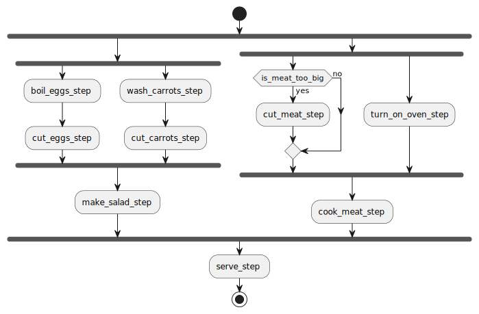

# Cook Example

Imagine we are making a dish, we need to:
1. Put the eggs to boil and cut them.
2. Wash the carrots and cut them.
3. Make a salad with the cut eggs and carrots.
4. Start the oven. 
5. If the meat is too big, cut it. 
6. Put the meat in the oven.
7. Serve when the meat and the salad are done.

This workflow is represented as such (with this same API, no need to draw it on your own)

This example is a simple demonstration on how to serve a dish (which in this case consists of meat + salad).

The approach used for this example was a static immutable graph, meaning:
- We create the graph only once and it can be reused as many times as wanted
- The graph doesn't contain any state. The state is passed at execution time as input

We showcase in different steps various approaches on how to create them:
- `cut_eggs_step.go`: A constructor method of a single step
- `cut_carrots_step.go`: A normal function that doesn't know about this API but is later injected into a step
- `cut_meat_step.go`: A custom step that allows us to do whatever complex logic we want to in a flexible and simple way. This is a custom step (similar to the ones the pipeline API provides)

For demonstration purposes, the graph is built inside the `main.go` in a single method. Note that you can easily decouple this into N more meaningfull methods (one for creating a step of the meat, another for the salad, etc)