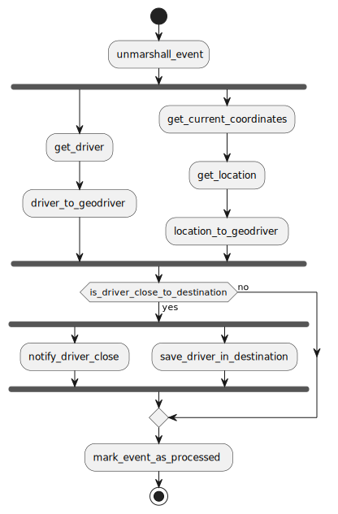

# Driver Geotracking Example

Imagine we are Uber or something of the likes, we want to be able to track the driver geolocation on a ride 
and based on events perform different stuff. For this sample we can imagine something like this:
1. We receive an event that indicates the driver has moved or something mutated from him
2. We unmarshall the event, to find the driver_id mutated
3. We concurrently get the driver information + the driver geolocation (which are different sources) from its ID
4. If the driver is close to its destination we concurrently send a notification notifying him + save this information
5. If the driver isn't close we skip step 4.
6. We mark the event as processed to avoid processing it again

This workflow is represented as such (with this same API, no need to draw it on your own)

This example is a simple demonstration on how to perform something that may couple different business units together
and probably their behavior (eg. concurrency between different stuff) + add complexity of doing this same stuff all
together

The approach used for this example was a static immutable graph, meaning:
- We create the graph only once and it can be reused as many times as wanted
- The graph doesn't contain any state. The state is passed at execution time as input

All steps in this example are contained inside the `main.go`, besides the custom step at `customsteps.go`. 
Note how in this sample none of the logic behavior, such as repositories, is coupled to the pipeline package
allowing extreme flexibility when integrating any code to it, since the code doesn't even realize its running
inside a pipeline.

For demonstration purposes, the graph is built inside the `main.go`. Note that you can easily decouple this into more
meaningful methods (eg. one for each step or for each concept of work)